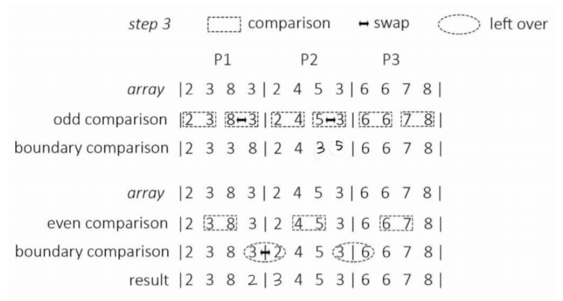
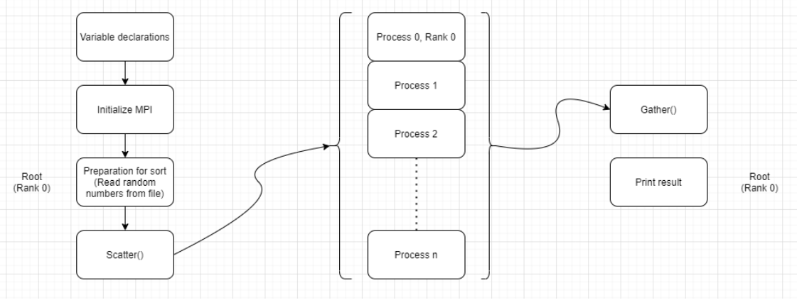
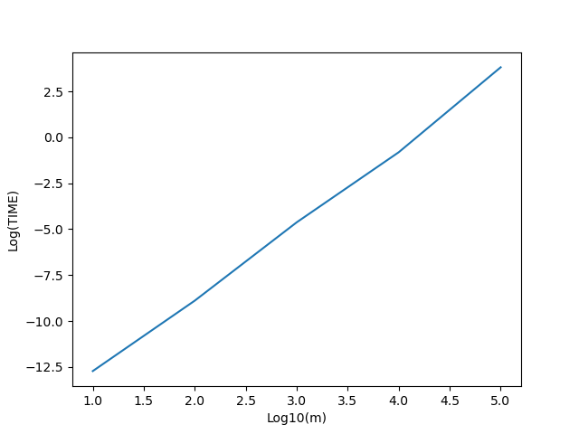
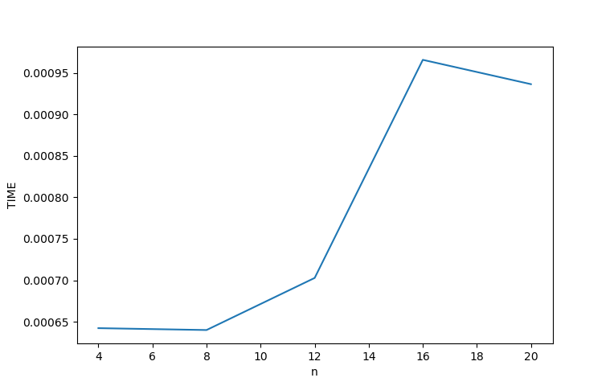
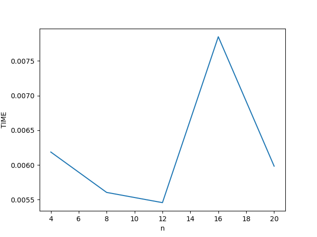
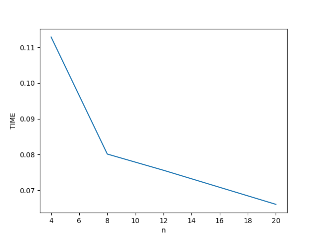
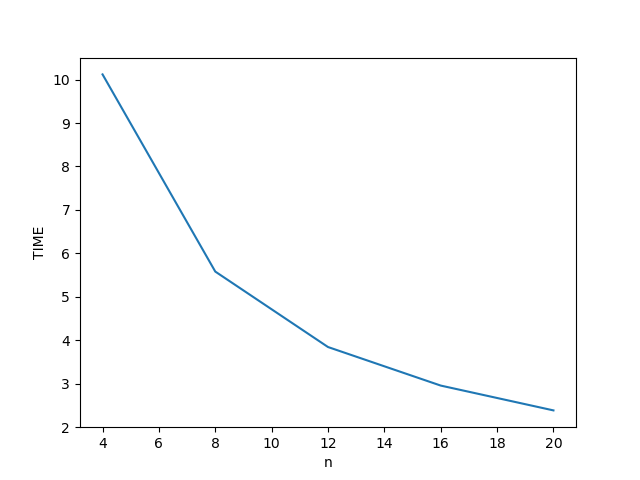
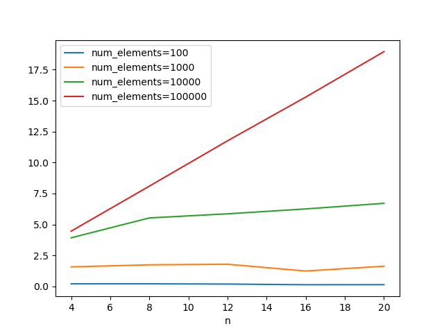
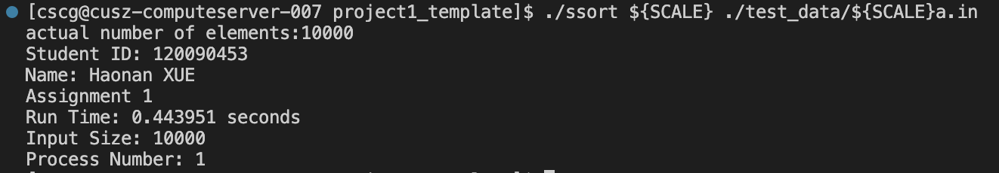
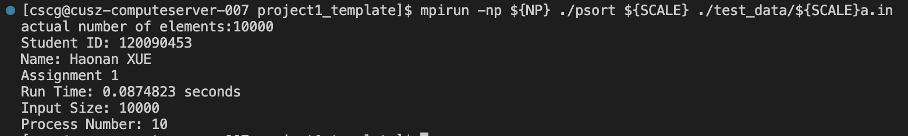

<style>
table {
margin: auto;
}
</style>
# CSC4005 Assignment 1 Report

Author: Haonan XUE

StudentID: 120090453

## 1. Description
In this homework, we are required to write a parallel odd-even transposition sort by using MPI. A parallel odd-even transposition sort is performed as follows:

Initially, m numbers are distributed to n processes, respectively.
1. Insides each process, compare the odd element with the posterior even element in odd
iteration, or the even element with the posterior odd element in even iteration respectively.
Swap the elements if the posterior element is smaller.
2. If the current process rank is P, and there some elements that are left over for comparison in
step 1, Compare the boundary elements with process with rank P-1 and P+1. If the posterior
element is smaller, swaps them.
3. Repeat 1-2 until the numbers are sorted.
We need to use MPI to design the program. The number of processors used to execute the
program is n that is much less than m. The following gure is an example to design your MPI
program:
P1, P2, P3 are three dierent processes
There are three operators that might need the communication among processes, i.e.,
comparison, swap, left over (boundary elements that should be compared).

<div align=center></div>


<div align=center>Figure 1. Problem description</div>


## 2. Test Envirionment

Since there is no need of cluster, this project is tested on a single node. The following information shows the test environment in the project.

Hardware Information
```
CPU: Intel(R) Xeon(R) Silver 4210R CPU @ 2.40GHz
RAM: 97585964 kB
```

Systerm Information
```
$ uname -r
5.19.13-zen1-1-zen
$ cat /etc/os-release 
NAME="Arch Linux"
PRETTY_NAME="Arch Linux"
ID=arch
BUILD_ID=rolling
ANSI_COLOR="38;2;23;147;209"
HOME_URL="https://archlinux.org/"
DOCUMENTATION_URL="https://wiki.archlinux.org/"
SUPPORT_URL="https://bbs.archlinux.org/"
BUG_REPORT_URL="https://bugs.archlinux.org/"
LOGO=archlinux-logo
```


MPI Information
```
Open MPI: 4.1.4
Open MPI repo revision: v4.1.4
C compiler: gcc
C compiler family name: GNU
C compiler version: 12.2.0
C++ compiler: g++
Fort compiler: gfortran
```


## 3. Algorithm Design

### 3.1 Preparation

At the same time, we can handle the random numbers depending on the num- ber of random numbers that need to be sorted. Based on the relationship between the number of processes (n) and the number of random numbers (m), we can divide into the following three cases:
1. When $n > m$, we use the maximum value of the int type to complete the random number so that the number of random numbers is equal to the number of processes.
2. When $n = m$, each process is assigned a random number, which is the simplest case.
3. When $n < m$,
- All random numbers divisible can be evenly distributed to each process with no remainder.
- The number of random numbers is not divisible by the number of processes, so we use the largest number of int types to make up the random numbers so that the number of numbers to be sorted is divisible by the number of processes.

After this processing, the number of random numbers in each process is equal and all are greater than or equal to 1.

### 3.2 Parallel odd-even transposition sort
Now, the number of random numbers in each process is equal, and we can divide it into two cases:
1. The number of random number is even.
If the number of the random number is even, we only need to compare and exchange data within processes, no inter-process communication in odd phase. In even phase. We first perform inter-process communication to compare and exchange inter-process data, and then perform intra-process data comparison and exchange (Figure 1).
Figure 1 The number of random number is even
2. The number of random number is odd. We can divide it into two cases:
- The number of processes is even. 
    - If the number of processes is even, and the number of random number is odd, we can consider the two processes as one process, and first communicate between them, and then the two processes will compare and exchange internal data separately in odd phase. In even phase, We exclude the first and last processes, and then the remaining processes can be processed in the same way as in the odd phase, where the first number j of the first and the last data of the last process do not need to be processed, and then the remaining data are compared and exchanged within the process.
- The number of process is odd.
    - If the number of processes is odd and the number of random number is odd, we disregard the last process, and then the even number of processes ahead of it are processed as before in odd phase. In even phase, we just don’t consider the first process, the rest of the steps are the same as before.
 
For the question of when to end the sort, to simplify the code, we make the entire comparison program loop n times (n is the number of total random numbers). Also, this approach does not require additional inter-process communication to determine whether the sort is finished.

<div align=center></div>


<div align=center>Figure 2. Program flow
</div>

## 4. Performance Analysis and Tuning

### 4.1 Sequential odd-even transposition sort
#### 4.1.1 Theoretical Performance
The odd-even transposition sort is based on the bubble sort technique. It compares two adjacent numbers and switches them, if the first number is greater than the second number to get an ascending order list.

| Worst case | Best case | Average | Space |
| :-: | :-: | :-: | :-: |
| $O(n^2)$ | $\Theta(n)$ | $O(n^2)$ | $O(1)$ |

<div align="center">Table 1. Algorithm Complexity</div>

#### 4.1.2 Actual Perfromance
Figure 3 indicates the number of random numbers and the logarithm of the time required to sort them. According to Figure 3, $log10(TIME)$ increases by 2 as the number of random numbers expands by a factor of ten each time.

<div align=center></div>


<div align=center>Figure 3. Performance of sequential algorithm
</div>

### 4.2 Parallel odd-even transportition sort

#### 4.2.1 Theoretical Performance

Assuming that $m$ numbers are sequentially assigned to $n$ processes, each process then has $\frac{m}{n}$ random numbers. In order to get the random numbers in order, all processes need to loop $m$ times. Each loop requires for communications between the processes (the left and right sides of the processes receive and send back respectively). 

Therefore, at each phase (odd/even), sorting between processes requires $O(\frac{n}{p})$, the communication is $O(1)$. As a result, the total sort time should be $O(\frac{n^2}{p})$, the total communication time is $O(p)$. Hence, the parallel odd-even transposition time should
be $O(n^2) + O(p)$.

#### 4.2.2 Actual Performance

In order to perform a performance analysis, we first need to collect some running data. The table below shows the run data averaged over several measurements. The leftmost column refers to the size of the data. $N$ refers to how many processes are used for sorting. The data in the rest of the table is the time it takes to sort the number of random numbers in the corresponding row using the processes corresponding to $N$. 

Overall, the more cores used, the shorter the time required to sort the same number of random numbers will be.

| M     | N=4        |       N=8   |       N=12  |    N=16      |      N=20    |
:-      |      -:    |        -:   |        -:   |  -:          |       -:     |
100     |0.000642291 | 0.000640025 |  0.000702811|  0.000965647 | 0.000936308  |
1000    |0.00618668  | 0.00560453  |  0.00545723 |  0.00784825  | 0.0059828    |
10000   | 0.112894   | 0.0801447   |  0.0756063  |  0.0708321   |  0.0660673   |
100000  |  10.1203   |  5.5809     |   3.84359   |   2.95601    |   2.38451    |

<div align=center>Table 2. Actual Performance of Parallel Algorithm</div>

<div align=center></div>

<div align=center>Figure 4. Performance under num_element=100</div>

<div align=center></div>

<div align=center>Figure 5. Performance under num_element=100</div>

<div align=center></div>

<div align=center>Figure 6. Performance under num_element=100</div>

<div align=center></div>

<div align=center>Figure 7. Performance under num_element=100</div>


We can see from the Figure 4 - Figure 7 that parallel computing does not necessarily speed up this sorting when the amount of data is small. This is because the communication between different processes is very slow. In these cases, using fewer processes would be a more sensible choice.

When the size of the data reaches one million (Figure 9), we can find that the time required for sorting almost halves as the number of cores doubles. When the number of processes is 2, I set it to ten minutes because of the server’s limitation to run the whole program. Therefore, when the amount of data is large enough, the impact of communication between processes on the sorting time will be negligible.

### 4.3 Speedup

In parallel computing, acceleration ratio is used to indicate how much faster the parallel algorithm is compared to the corresponding sequential execution algorithm. The acceleration ratio is defined by the following formula: $S_p=\frac{T}{T_p}$ = T1 , which $p$ indicates the number of processes, $T$ indicates the execution time of the sequential execution algorithm, $T_p$ indicates the execution time of the parallel algorithm when there are $p$ processes.

<div align=center></div>

<div align=center>Figure 8. Speedup Performance</div>

## 5 How to run the code?

First, change working directory to the place where the code locates.
```
cd xxx      # xxx is the place where the code locates
```

Second, compile the code.
```
g++ odd_even_sequential_sort.cpp -o ssort
mpic++ odd_even_parallel_sort.cpp -o psort 
```

Then 2 executable file `./ssort` and `./psort` get.

Finally, run `./ssort` or `./psort` with the following forma.
```
./ssort num_elements datafile
mpirun -np n ./psort num_elements datafile
```

Output will be written to the place of the input file with a suffix of `.out`

## 6 Result

For the main project, the result is Figure 9 and Figure 10.

<div align=center></div>

<div align=center>Figure 9. Result of Sequential Algorithm</div>

<div align=center></div>

<div align=center>Figure 10. Result of Parallel Algorithm</div>


## 7 Conclusion
In general, parallel programs will run faster than serial programs. However, when the amount of data is small, the serial program may be faster than the parallel program due to the inter-process communication. At this time, using fewer processes may give better results. When the amount of data is larger, the parallel program will run faster as the number of processes increases.

## 8 Code

`odd_even_parallel_sort.cpp`
```c++
#include <mpi.h>
#include <chrono>
#include <cstdlib>
#include <fstream>
#include <iostream>

int main(int argc, char** argv)
{
    MPI_Init(&argc, &argv);

    int rank;
    MPI_Comm_rank(MPI_COMM_WORLD, &rank);

    int world_size;
    MPI_Comm_size(MPI_COMM_WORLD, &world_size);

    int num_elements;  // number of elements to be sorted

    num_elements = atoi(argv[1]);  // convert command line argument to num_elements
    if (num_elements % world_size != 0)
    {
        num_elements += world_size - (num_elements % world_size);
    }
    int elements[num_elements];         // store elements
    int sorted_elements[num_elements];  // store sorted elements

    if (rank == 0)
    {  // read inputs from file (master process)
        std::ifstream input(argv[2]);
        int element;
        int i = 0;
        while (input >> element)
        {
            elements[i] = element;
            i++;
        }
        while (i < num_elements)
        {
            elements[i] = 0;
            i++;
        }
        std::cout << "actual number of elements:" << i << std::endl;
    }

    std::chrono::high_resolution_clock::time_point t1;
    std::chrono::high_resolution_clock::time_point t2;
    std::chrono::duration<double> time_span;
    if (rank == 0)
    {
        t1 = std::chrono::high_resolution_clock::now();  // record time
    }

    /* TODO BEGIN
        Implement parallel odd even transposition sort Code in this block is not a necessary. Replace it with your own code. Useful MPI documentation: https://rookiehpc.github.io/mpi/docs
    */

    int num_my_element = num_elements / world_size;  // number of elements allocated to each process
    int my_element[num_my_element];                  // store elements of each process
    MPI_Scatter(elements,
                num_my_element,
                MPI_INT,
                my_element,
                num_my_element,
                MPI_INT,
                0,
                MPI_COMM_WORLD);  // distribute elements to each process

    int flags[world_size] = {0}, tmpFlag;
    // std::cout << num_my_element << std::endl;
    for (int k = 0; k < num_elements; ++k)
    {
        for (int i = 0; i < num_my_element - 1; i += 2)
        {
            if (my_element[i] > my_element[i + 1])
            {
                int tmp = my_element[i + 1];
                my_element[i + 1] = my_element[i];
                my_element[i] = tmp;
                // flag = true;
            }
        }
        for (int i = 1; i < num_my_element - 1; i += 2)
        {
            if (my_element[i] > my_element[i + 1])
            {
                int tmp = my_element[i + 1];
                my_element[i + 1] = my_element[i];
                my_element[i] = tmp;
                // flag = true;
            }
        }

        int headbuf = -1, tailbuf = -1;
        MPI_Status headstatus, tailstatus;
        if (rank != 0)
            MPI_Send(my_element, 1, MPI_INT, rank - 1, 0, MPI_COMM_WORLD);
        if (rank != world_size - 1)
            MPI_Send(my_element + num_my_element - 1, 1, MPI_INT, rank + 1, 0, MPI_COMM_WORLD);
        // MPI_Barrier(MPI_COMM_WORLD);
        if (rank != 0)
            MPI_Recv(&headbuf, 1, MPI_INT, rank - 1, 0, MPI_COMM_WORLD, MPI_STATUS_IGNORE);
        if (rank != world_size - 1)
            MPI_Recv(&tailbuf, 1, MPI_INT, rank + 1, 0, MPI_COMM_WORLD, MPI_STATUS_IGNORE);

        tmpFlag = (tailbuf < my_element[num_my_element - 1]) && rank != world_size - 1 ? 0 : 1;
        // MPI_Barrier(MPI_COMM_WORLD);
        my_element[num_my_element - 1] =
            (tailbuf < my_element[num_my_element - 1]) && (tailbuf != -1) ? tailbuf : my_element[num_my_element - 1];
        my_element[0] =
            (headbuf > my_element[0]) && (headbuf != -1) ? headbuf : my_element[0];
    }
    MPI_Gather(my_element,
               num_my_element,
               MPI_INT,
               sorted_elements,
               num_my_element,
               MPI_INT,
               0,
               MPI_COMM_WORLD);  // collect result from each process

    /* TODO END */

    if (rank == 0)
    {  // record time (only executed in master
       // process)
        t2 = std::chrono::high_resolution_clock::now();
        time_span = std::chrono::duration_cast<std::chrono::duration<double>>(t2 - t1);
        std::cout << "Student ID: "
                  << "120090453" << std::endl;  // replace it with your student id
        std::cout << "Name: "
                  << "Haonan XUE" << std::endl;  // replace it with your name
        std::cout << "Assignment 1" << std::endl;
        std::cout << "Run Time: " << time_span.count() << " seconds" << std::endl;
        std::cout << "Input Size: " << num_elements << std::endl;
        std::cout << "Process Number: " << world_size << std::endl;
    }

    if (rank == 0)
    {  // write result to file (only executed in master process)
        std::ofstream output(argv[2] + std::string(".parallel.out"),
                             std::ios_base::out);
        for (int i = 0; i < num_elements; i++)
        {
            if (sorted_elements[i] == 0)
                continue;
            output << sorted_elements[i] << std::endl;
            // std::cout << sorted_elements[i] << std::endl;
        }
    }

    MPI_Finalize();

    return 0;
}
```

`odd_even_sequential_sort.cpp`
```c++
#include <algorithm>
#include <chrono>
#include <cstdlib>
#include <fstream>
#include <iostream>

int main(int argc, char** argv)
{
    int num_elements;              // number of elements to be sorted
    num_elements = atoi(argv[1]);  // convert command line argument to num_elements

    int elements[num_elements];         // store elements
    int sorted_elements[num_elements];  // store sorted elements

    std::ifstream input(argv[2]);
    int element;
    int i = 0;
    while (input >> element)
    {
        elements[i] = element;
        i++;
    }
    std::cout << "actual number of elements:" << i << std::endl;

    std::chrono::high_resolution_clock::time_point t1;
    std::chrono::high_resolution_clock::time_point t2;
    std::chrono::duration<double> time_span;
    t1 = std::chrono::high_resolution_clock::now();  // record time

    /* TODO BEGIN
        Implement sequential odd even transposition sort
        Code in this block is not a necessary.
        Replace it with your own code.
    */

    bool flag = false;
    while (!flag)
    {
        flag = true;
        for (int i = 0; i < num_elements; i += 2)
        {
            if (elements[i] > elements[(i + 1) % num_elements])
            {
                flag = false;
                std::swap(elements[i], elements[i + 1]);
            }
        }
        for (int i = 1; i < num_elements; i += 2)
        {
            if (elements[i] > elements[(i + 1) % num_elements])
            {
                flag = false;
                std::swap(elements[i], elements[i + 1]);
            }
        }
    }
    for (int i = 0; i < num_elements; i++)
    {
        sorted_elements[i] = elements[i];
    }
    /* TODO END */

    t2 = std::chrono::high_resolution_clock::now();
    time_span = std::chrono::duration_cast<std::chrono::duration<double>>(t2 - t1);
    std::cout << "Student ID: "
              << "120090453" << std::endl;  // replace it with your student id
    std::cout << "Name: "
              << "Haonan XUE" << std::endl;  // replace it with your name
    std::cout << "Assignment 1" << std::endl;
    std::cout << "Run Time: " << time_span.count() << " seconds" << std::endl;
    std::cout << "Input Size: " << num_elements << std::endl;
    std::cout << "Process Number: " << 1 << std::endl;

    std::ofstream output(argv[2] + std::string(".seq.out"), std::ios_base::out);
    for (int i = 0; i < num_elements; i++)
    {
        output << sorted_elements[i] << std::endl;
    }

    return 0;
}
```